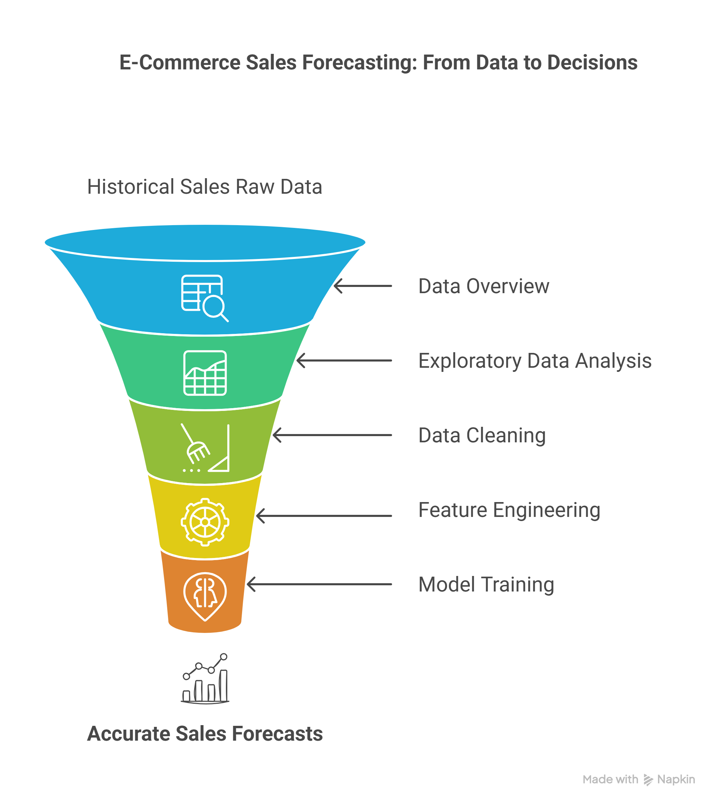
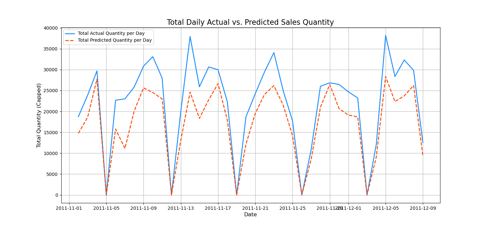
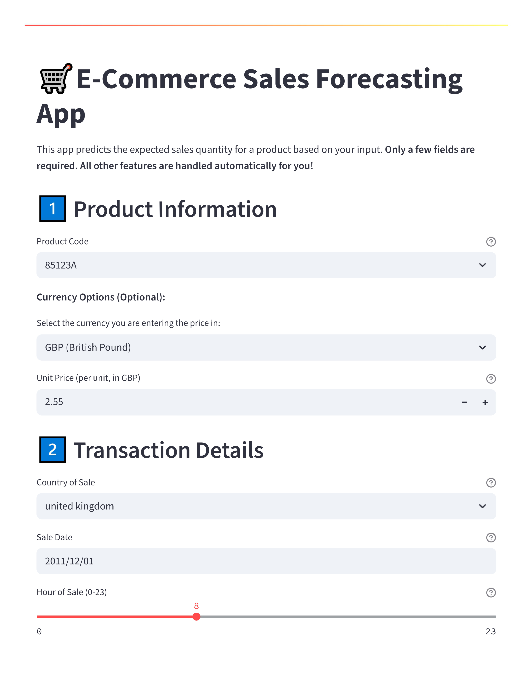
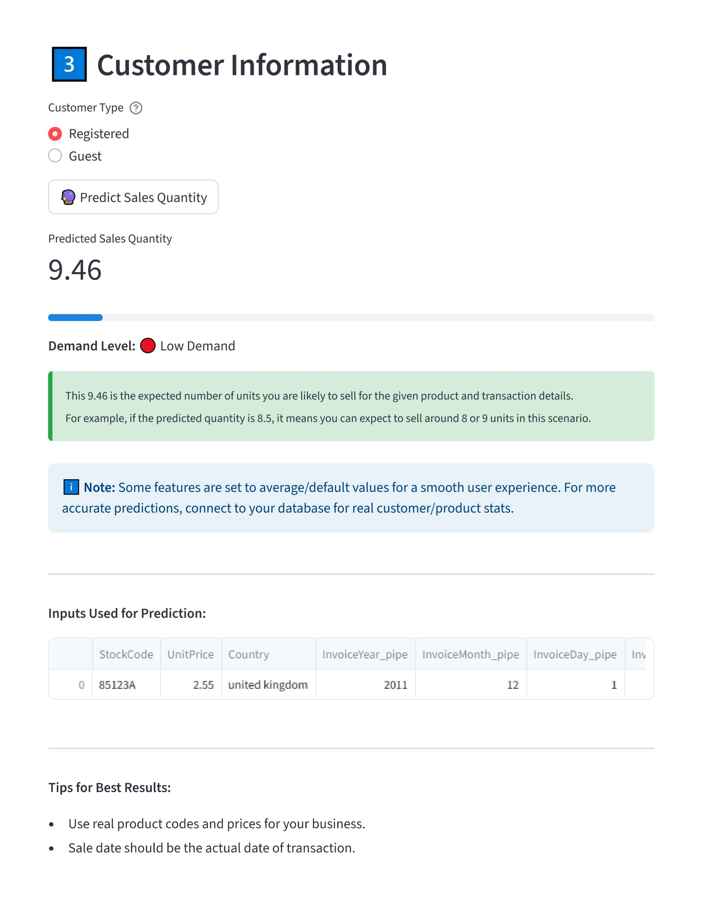

# 🛒 E-Commerce Sales Forecasting — ML Pipeline & Web App

[](YOUR_STREAMLIT_APP_LINK_HERE)
[](LICENSE)

---

## **Project Overview**

This project demonstrates a complete, end-to-end **machine learning pipeline** for forecasting product sales in an e-commerce setting.  
It includes **in-depth EDA, feature engineering, model training/tuning, and a deployed Streamlit web app** for interactive predictions.

<small>[📄 Click here for a detailed section-wise summary of the notebook and app.](notebooks/SUMMARY.md)</small>
---

## **Key Features**

- 📊 **Comprehensive EDA:** Outlier detection, feature analysis, and business insights.
- 🧑‍💻 **Feature Engineering:** RFM, time-based, and product-level features.
- 🤖 **Modeling:** XGBoost/LightGBM with hyperparameter tuning and robust evaluation.
- 🌐 **Interactive Web App:** User-friendly Streamlit app for real-time sales forecasting.
- 📝 **Clean Code & Documentation:** Modular, reproducible, and well-commented.
- 🚦 **Professional UX:** Clear limitations, tips, and personal branding.

---

## **Project Structure**

```
ecommerce-sales-forecasting/
│
├── app/                        # Streamlit web app
│   ├── app.py
│   ├── requirements.txt
│   └── sales_forecaster_xgb_v1.0.pkl
│
├── data/
│   └── processed/
│       ├── online_retail_cleaned.parquet
│       └── Online Retail.xlsx
│
├── models/
│   ├── tuning_results/
│   └── sales_forecaster_xgb_v1.0.pkl
│
├── notebooks/
│   ├── ecommerce-sales-forecasting.ipynb
│   ├── SUMMAR.md
│   └── requirements.txt
│
├── visuals/
│   ├── analysis phase (from raw data)/
│   ├── cleaned_data_visualization/
│   ├── screenshots/
│   └── trained_model/
│   
│
├── requirements.txt            # (Optional) Full project requirements
├── LICENSE
└── README.md                   # This file
```

---

## **How to Run Locally**

### **1. Clone the Repository**
```bash
git clone https://github.com/zainafxal/ecommerce-sales-forecasting.git
cd ecommerce-sales-forecasting
```

### **2. Set Up Environment**

- **For the Streamlit App:**
    ```bash
    cd app
    pip install -r requirements.txt
    streamlit run app.py
    ```

- **For the Notebook:**
    ```bash
    cd notebooks
    pip install -r requirements.txt
    jupyter notebook
    ```

### **3. (Optional) Full Project Environment**
```bash
pip install -r requirements.txt
```

---

## **Live Demo**

👉 [Try the Streamlit App Here!](YOUR_STREAMLIT_APP_LINK_HERE)

---

## **Screenshots**

**Notebook Processes**

 <br>

**Model Evaluation (Actual vs Predicted)**

 <br>

**Streamlit App — Input Form**

 <br>

**Streamlit App — Prediction Result**



---

## **Model Limitations & Notes**

- Trained on 2010-2011 e-commerce data (mostly UK sales).
- May be less accurate for other countries or recent years.
- Does not account for promotions, holidays, or external events.
- Best for products/customers similar to the training data.
- **Disclaimer:** This project is for educational and portfolio demonstration purposes. Model predictions are based on historical data and may not be suitable for direct business use without further validation and adaptation.

---

## **About the Creator**

**Muhammad Zain**  
Data Scientist | AI Engineer | Applied ML Developer | LLM Developer<br>
[GitHub](https://github.com/zainafxal) | [LinkedIn](https://www.linkedin.com/in/zainafxal/)

---

## **License**

This project is open-source and available under the [CC BY 4.0 License](LICENSE).

---

## **Acknowledgements**

- [UCI Machine Learning Repository: Online Retail Dataset](https://archive.ics.uci.edu/ml/datasets/online+retail)
- [Streamlit](https://streamlit.io/)
- [XGBoost](https://xgboost.readthedocs.io/)
- [scikit-learn](https://scikit-learn.org/)

---

**Feel free to fork, star, or connect! 🚀**