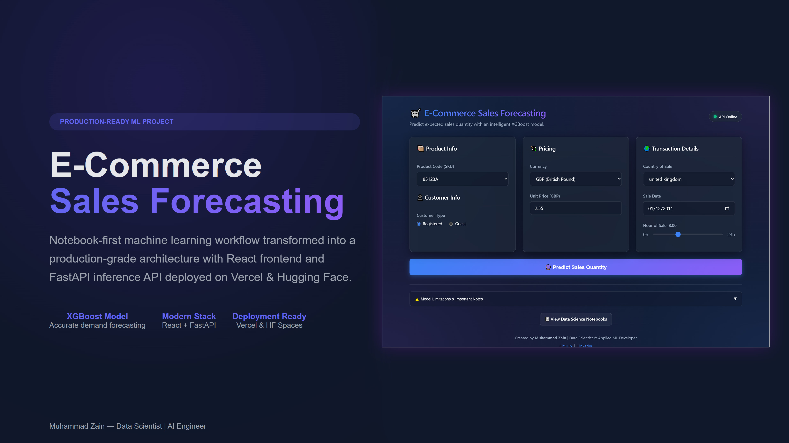
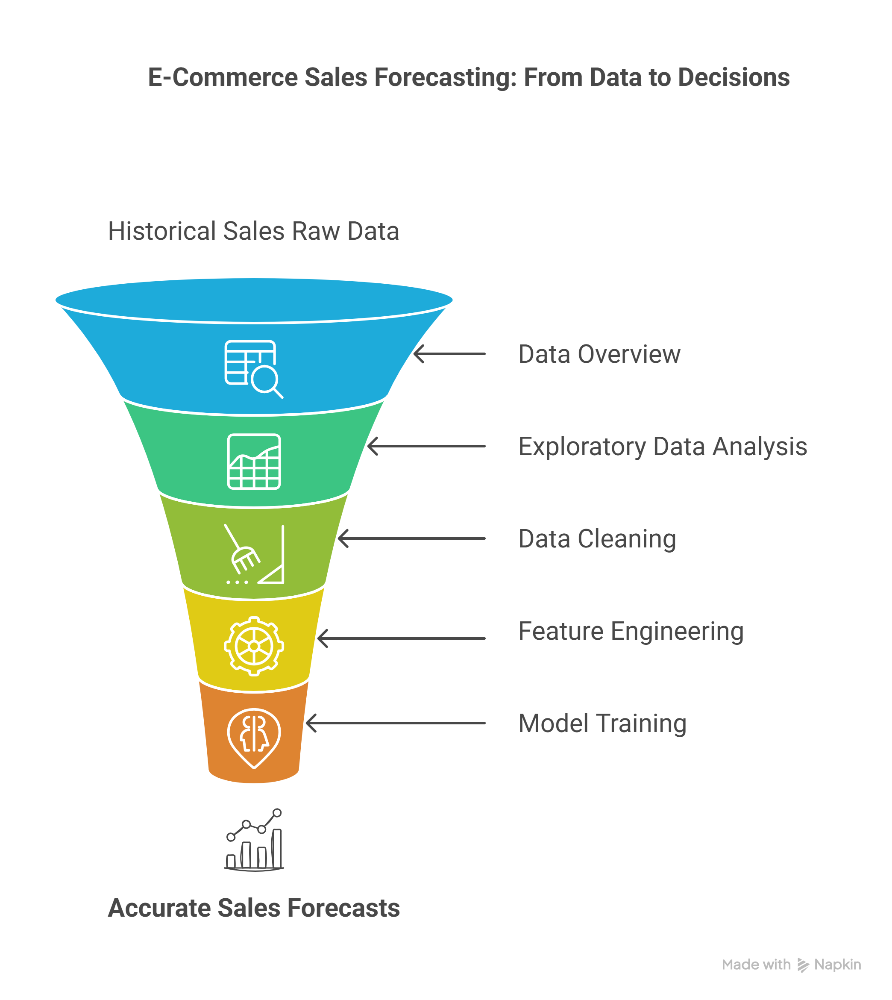
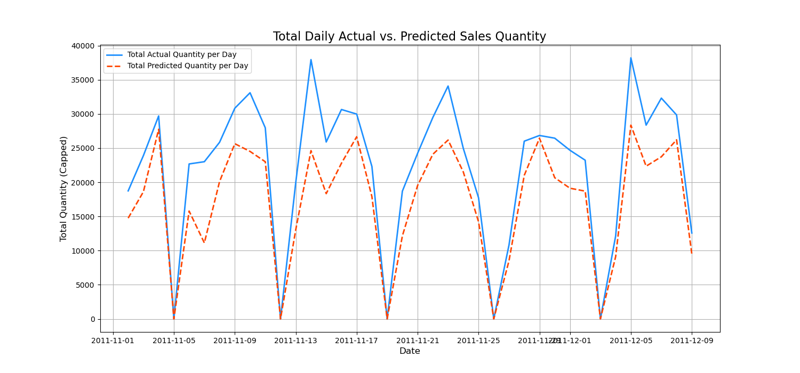
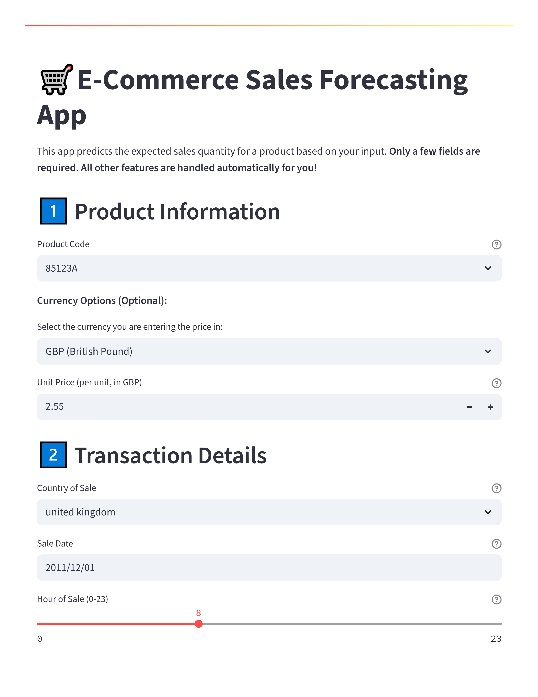
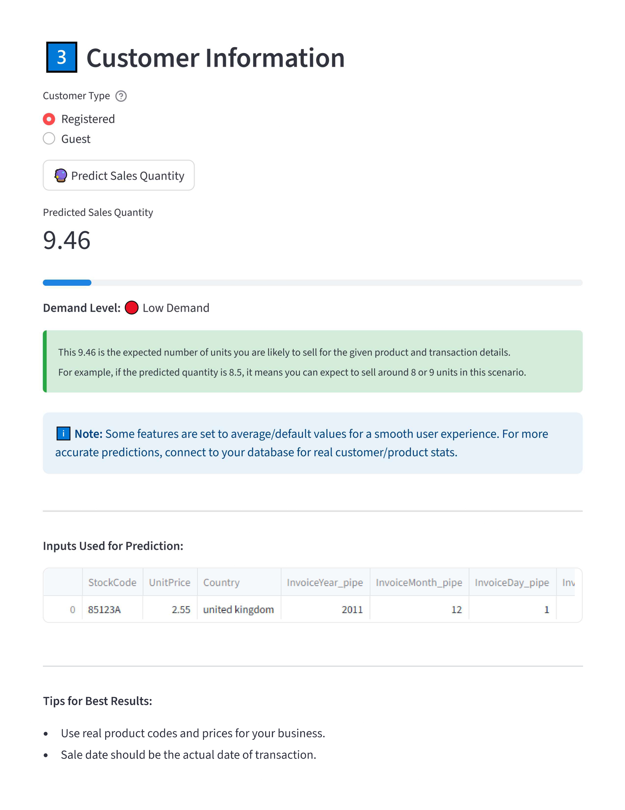

<div align="center">

# 🚀 E-Commerce Sales Forecasting

Production-ready **Live Machine Learning Web Application**  
Built with React (Frontend) + FastAPI (Backend) + XGBoost

<br>

### 🌐 Live Deployment

🔗 **Backend API (Hugging Face Spaces)**  
https://zainafxal-ecommerce-sales-api.hf.space/

🔗 **Interactive API Docs**  
https://zainafxal-ecommerce-sales-api.hf.space/docs

🔗 **Frontend (React + Vercel)**  
https://ecommerce-sales-forecasting.vercel.app/

<br>

### 🏷 Tech Stack


</div>

---

## 📸 Application Preview

<div align="center">



</div>

<small>[📄 Click here for a detailed section-wise summary of the notebook and app.](notebooks/SUMMARY.md)</small>

---

## Overview

Production-ready e-commerce sales forecasting project built around a notebook-first machine learning workflow, a modern React frontend deployed on **Vercel**, and a FastAPI inference API deployed on **Hugging Face Spaces**.

This is a fully **live deployed project** where:

- ✅ Frontend is publicly hosted on Vercel  
- ✅ Backend API is publicly deployed on Hugging Face Spaces  
- ✅ Model is dynamically loaded from Hugging Face Hub  
- ✅ Prediction endpoint is rate-limited for production safety  

---

## Current Architecture

```text
ecommerce-sales-forecasting/
|-- app/                    Legacy Streamlit app
|-- app-react-frontend/     React + Vite frontend for Vercel (LIVE)
|-- backend/                FastAPI API for Hugging Face Spaces (LIVE)
|-- data/                   Project data assets
|-- models/                 Trained model artifacts and experiments
|-- notebooks/              Data science notebooks and summaries
|-- visuals/                Screenshots and project media
|-- .gitattributes          Git LFS tracking rules
|-- .gitignore              Root Git ignore rules
`-- README.md
```

## What The Project Does

- Forecasts expected item sales quantity from transaction-level inputs
- Uses a trained XGBoost model with the same business logic reflected across the UI and API
- Highlights the notebook workflow as the main source of the project's analytical and modeling value
- Supports both local development and cloud deployment

## Key Features

- Notebook-first machine learning workflow with EDA, feature engineering, training, and evaluation
- Modern React interface with API health indicator, notebook access CTA, and model limitation notes
- FastAPI backend with structured routing, schema validation, env-based configuration, and deployment-ready model loading
- Rate-limited public prediction endpoint for safer internet-facing deployment
- Hugging Face-aware model loading strategy
- Git LFS tracking for large model and dataset artifact formats

## Rate Limiting And Request Queueing

The public prediction endpoint is protected with professional per-IP rate limiting through backend middleware.

- Endpoint protected: `POST /api/v1/predict`
- Default policy: `10/minute` per client IP
- Configurable through `backend/.env`

Request queueing is not implemented as a custom application-side queue because it is not necessary for this deployment target:

- FastAPI/Uvicorn already handles concurrent async request processing
- Hugging Face Spaces places an upstream proxy in front of the container, which queues traffic when the service is busy

This keeps the backend simpler, more maintainable, and aligned with the actual runtime behavior of the target platform.

## Model Loading Strategy

The backend supports both development and deployment modes:

- Local development: loads `backend/model/sales_forecaster_xgb_v1.0.pkl`
- Hugging Face deployment: downloads the model from a Hugging Face model repository when `IS_HF_SPACE=True`

This means the same codebase works in both places while keeping the cloud image lighter and easier to maintain.

## Git LFS

Large ML artifacts are configured for Git LFS through the root `.gitattributes` file. This covers:

- `*.pkl`
- `*.joblib`
- `*.h5`
- `*.csv`

Important model locations already covered by these rules:

- `backend/model/`
- `models/`

If Git LFS is not already installed on your machine, run the one-time setup before your first large-file commit:

```bash
git lfs install
```

After that, the repository rules handle tracking automatically.

## Local Development

### Backend

```bash
cd backend
conda create -n sales-api-env python=3.10 -y
conda activate sales-api-env
pip install -r requirements.txt
uvicorn main:app --reload
```

API docs will be available at [http://127.0.0.1:8000/docs](http://127.0.0.1:8000/docs).

### Frontend

```bash
cd app-react-frontend
npm install
npm run dev
```

The Vite app runs by default at [http://localhost:5173](http://localhost:5173).

### Streamlit App

```bash
cd app
pip install -r requirements.txt
streamlit run app.py
```

## Environment Configuration

### Frontend

Use `app-react-frontend/.env`:

```env
VITE_API_BASE_URL=http://localhost:8000/api/v1
```

### Backend

Use `backend/.env`:

```env
IS_HF_SPACE=False
HF_MODEL_REPO_ID=zainafxal/ecommerce-sales-forecasting-model
HF_MODEL_FILENAME=sales_forecaster_xgb_v1.0.pkl
API_RATE_LIMIT=10/minute
BACKEND_CORS_ORIGINS=http://localhost:5173,http://127.0.0.1:5173
BACKEND_CORS_ORIGIN_REGEX=https://.*\.vercel\.app$|https://.*\.hf\.space$
```

Sample env files are included as:

- `backend/.env.example`
- `app-react-frontend/.env.example`

## Deployment Targets

### Frontend on Vercel

- Deploy the `app-react-frontend/` project
- Set `VITE_API_BASE_URL` to your Hugging Face API URL plus `/api/v1`
- Example: `https://your-space-name.hf.space/api/v1`

### Backend on Hugging Face Spaces

- Deploy the `backend/` folder as a Docker Space
- Keep `IS_HF_SPACE=True` in the Space variables
- Set `HF_MODEL_REPO_ID` to the actual model repo you want to download from
- The included Dockerfile is optimized for a lightweight API image and avoids bundling the local `model/` directory into the container build context

## Documentation Map

- Root overview: `README.md`
- Backend deployment and API docs: `backend/README.md`
- Frontend development and Vercel docs: `app-react-frontend/README.md`
- Migration context: `Migrating Streamlit App to React.md`

---

## **Screenshots**

**Notebook Processes**

 <br>

**Model Evaluation (Actual vs Predicted)**

 <br>

**Streamlit App — Input Form**

 <br>

**Streamlit App — Prediction Result**



---

## Model Limitations

- Trained on historical 2010-2011 retail data
- Strongly influenced by the distribution of the original dataset, especially UK-heavy behavior
- Does not directly model promotions, holidays, logistics shocks, or broader market changes
- Best suited for educational, portfolio, and baseline forecasting use cases unless retrained and validated on fresher business data

---
<div align="center">

## 🧠 Project Status

🟢 Frontend: **LIVE & DEPLOYED (Vercel)**  
🟢 Backend: **LIVE & DEPLOYED (Hugging Face Spaces)**  
🟢 Model: **ACTIVE (Hugging Face Hub)**  
🟢 API: **PRODUCTION READY (Rate Limited)**  

---

## 💡 Key Highlights

✔ End-to-end ML system (Notebook → API → Frontend)  
✔ Real-time inference pipeline  
✔ Production-grade FastAPI backend  
✔ Cloud deployed frontend (React + Vercel)  
✔ Scalable model serving architecture  
✔ Clean separation of UI & backend services  

---

## 👨‍💻 Author

### Muhammad Zain  
💼 Data Scientist | AI Engineer | ML Systems Developer  

🌐 GitHub: https://github.com/zainafxal  
🔗 LinkedIn: https://www.linkedin.com/in/zainafxal/  

---

## ⭐ Support

If you like this project:

⭐ Star the repository  
🍴 Fork it  
🚀 Share it with others  

---

## 📜 License

This project is licensed under the **Creative Commons Attribution 4.0 International License**.

---

### ⚡ Built with passion, deployed with precision.

</div>
